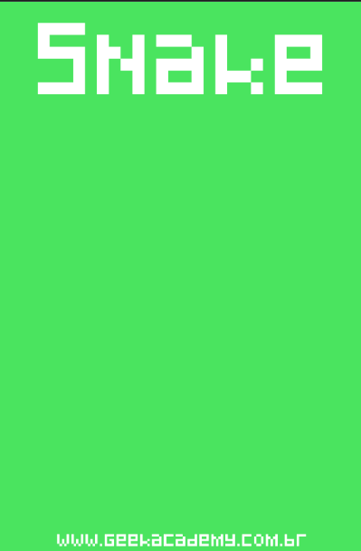

# my-snake
Jogo desenvolvido no Curso de Libgdx da Udemy para dispositivos Android. 

  
Jogue o demo do jogo [clicando aqui](https://mighty-falls-24572.herokuapp.com/).

## Como jogar
* Arraste o touch do celular na direção que deseja mover a cobra (ou use botões de direção no PC).
* Evite bater nas paredes laterais.
* Se morrer, toque na tela para reiniciar.

## Instalar versão Android
* Fazer o download e instalação do APK através de seu dispositivo móvel, [clicando aqui](https://bit.ly/2UX66I5). 
